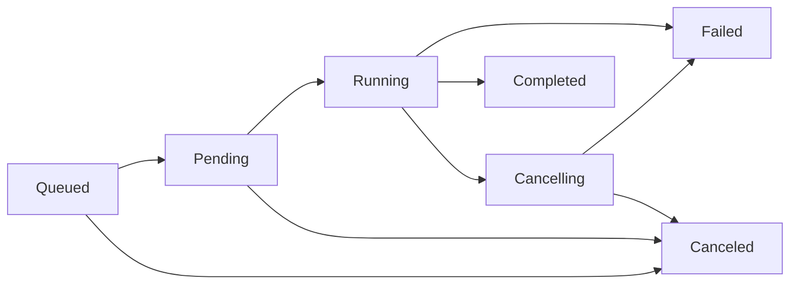

JackBaboon.jl
=============

[](https://github.com/JuliaCI/Coverage.jl/actions/workflows/CI.yml?query=branch%3Amaster)
[](https://github.com/OWNER/JackBaboon/actions/workflows/CI.yml)
[](https://codecov.io/gh/OWNER/JackBaboon)
[](https://OWNER.github.io/JackBaboon/)

Task executor with limited concurrency for Julia.

### Fast Start

```julia
executor = Executor(pool = :default, queue_size=4, concurrently=2)

# Asynchronous execution:

handle = submit!(executor) do cancel
    do_work(cancel)
end

fetch(handle)

# Synchronous execution:

result = execute!(executor) do cancel
    do_work(cancel)
end
```

### Job States



### License

MIT — see [LICENSE](LICENSE).
