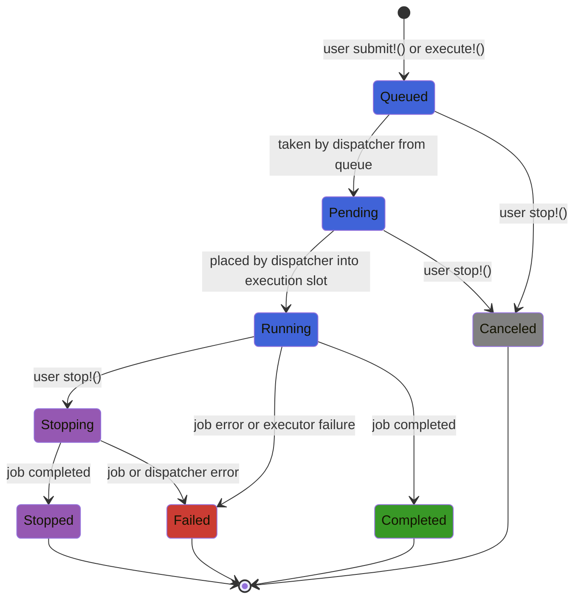

[](https://github.com/andreykochegura/JackBaboon/actions/workflows/CI.yml)
[](https://codecov.io/gh/andreykochegura/JackBaboon.jl)
[](https://andreykochegura.github.io/JackBaboon.jl/)
[](https://julialang.org/)
[](https://github.com/andreykochegura/JackBaboon.jl)
[](LICENSE)

# JackBaboon.jl

*One day, a Python service, exhausted by CPU-bound load, decided to shift some of it to a Julia microservice and breathed a sigh of relief. Countless overjoyed service users launched countless Python coroutines, and those launched countless Julia tasks... And then JackBaboon and his legless master came to the rescue!*

<div style="display:flex; align-items:center; gap:24px;">
<div style="flex:1; min-width:0;">
JackBaboon.jl is a production-oriented Julia executor:

- Bounded queue with controlled concurrency and backpressure.
- Synchronous and asynchronous job execution.
- Cooperative job cancellation.
- Explicit job state machine.
- Graceful shutdown.
- Isolated job failures.
</div>
<div style="flex:0 1 320px; min-width:350px;">

</div>
</div>

## Fast Start

### Install

```julia-repl
julia>] add https://github.com/andreykochegura/JackBaboon.jl
```

### Example

<div style="display:flex; align-items:center; gap:24px;">
<div style="flex:1; min-width:0;">

```julia-repl
julia> using JackBaboon

julia> executor = Executor(
           pool           = :default,
           queue_capacity = 8,
           concurrently   = 2,
       );

julia> result = execute!(executor) do cancel_token
           2+3
       end;
5
```
</div>
<div style="flex:0 1 320px; min-width:350px;">

</div>
</div>

## Execution Model

### Capacity & Backpressure

* The `Executor` maintains a bounded queue of accepted jobs..
* The executor queue is bounded by `queue_capacity`.
* When the **queue** reaches `queue_capacity`, new jobs are rejected with `ExecutorRejectedError`.
* The number of concurrently executing jobs is bounded by `concurrently`.
* A job becomes `Pending` before acquiring an execution slot.

### Why without workers?

A task is created for each running job. Persistent worker tasks are intentionally not used:

* Worker tasks may become thread-affine and reduce scheduling flexibility.
* Worker tasks may retain unintended task-local execution context between jobs.
* Worker tasks may fail, stall, or become a source of cascading failures.

### Job Lifecycle

Each accepted job follows a lifecycle represented by a state machine diagram.

- `Queued`: the job has been accepted and is waiting in the executor queue.
- `Pending`: the job has been admitted by the dispatcher and is waiting for an execution slot.
- `Running`: the job is executing.
- `Stopping`: cancellation has been requested for a running job; job completion is the user's responsibility.
- `Stopped`: a `Running` job completed after a cancellation request.
- `Canceled`: a `Queued` or `Pending` job was canceled before it became `Running`.
- `Completed`: the job completed successfully.
- `Failed`: the job terminated due to a job error or an executor dispatcher error.

### State Machine Diagram




## Planned

<div style="display:flex; align-items:center; gap:24px;">
<div style="flex:1; min-width:0;">

- Metrics.
- Priorities.
- Pause and resume.
- Diagnostic warnings.

</div>
<div style="flex:0 1 320px; min-width:350px;">

</div>
</div>

## P.S.

Hopefully, the brave baboon will help you to protect your critical Julia tasks.
