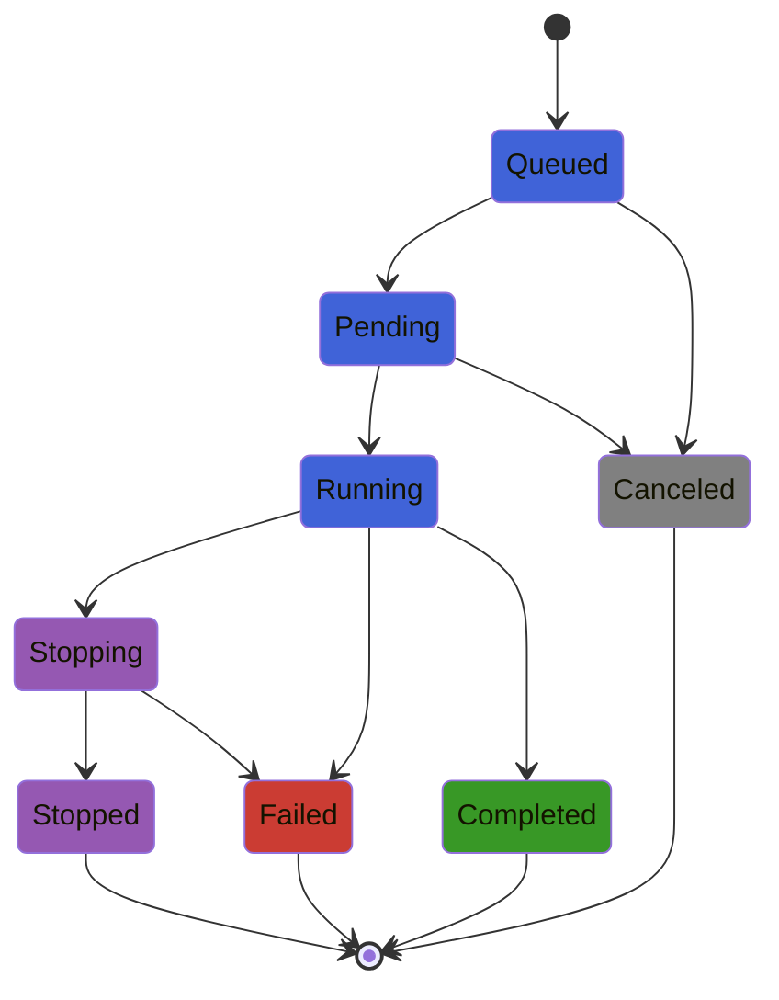

[](https://github.com/andreykochegura/JackBaboon/actions/workflows/CI.yml)
[](https://codecov.io/gh/andreykochegura/JackBaboon)
[](https://andreykochegura.github.io/JackBaboon/)
[](https://julialang.org/)
[](https://github.com/andreykochegura/JackBaboon)
[](LICENSE)

# JackBaboon.jl

*One day, a Python service, exhausted by CPU-bound load, decided to shift some of it to a Julia microservice and breathed a sigh of relief. Countless overjoyed service users launched countless Python coroutines, and those launched countless Julia tasks... And then JackBaboon and his legless master came to the rescue!*

<div style="display:flex; align-items:center; gap:24px;">
<div style="flex:1; min-width:0;">
JackBaboon is a production-oriented Julia executor:

- Bounded job queue, concurrency and rejection.
- Synchronous and asynchronous thread-pool execution.
- Cooperative job cancellation.
- Explicit job state machine.
- Graceful <!-- and immediate. -->shutdown.
- Fail-safe execution.
</div>
<div style="flex:0 1 320px; min-width:350px;">

</div>
</div>

## Install

```julia-repl
julia>] add https://github.com/andreykochegura/JackBaboon.jl
```

## Fast Start

<div style="display:flex; align-items:center; gap:24px;">
<div style="flex:1; min-width:0;">

```julia-repl
julia> using JackBaboon

julia> executor = Executor();

julia> result = execute!(executor) do cancel_token
           do_work()
       end;
```
</div>
<div style="flex:0 1 320px; min-width:350px;">

</div>
</div>

## Execution Model

A task is created for each running job. Worker-tasks are intentionally not used:

* A worker may become thread-affine and introduce unpredictable delays.
* A worker may retain contaminated or unexpected execution context.
* A worker may fail, stall, or become a source of cascading failures.

#### State Machine Diagram



## Future

<div style="display:flex; align-items:center; gap:24px;">
<div style="flex:1; min-width:0;">

- immediate shutdown
- detailed examples
- benchmarks
- metrics
- prioritet
- pause and resume
- etc.

</div>
<div style="flex:0 1 320px; min-width:350px;">

</div>
</div>

## P.S.

Hopefully, the brave baboon will help you to protect your critical Julia tasks.
